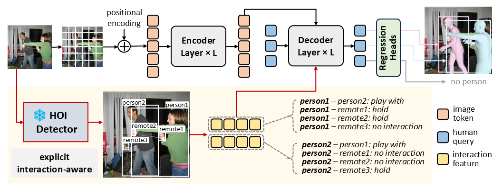
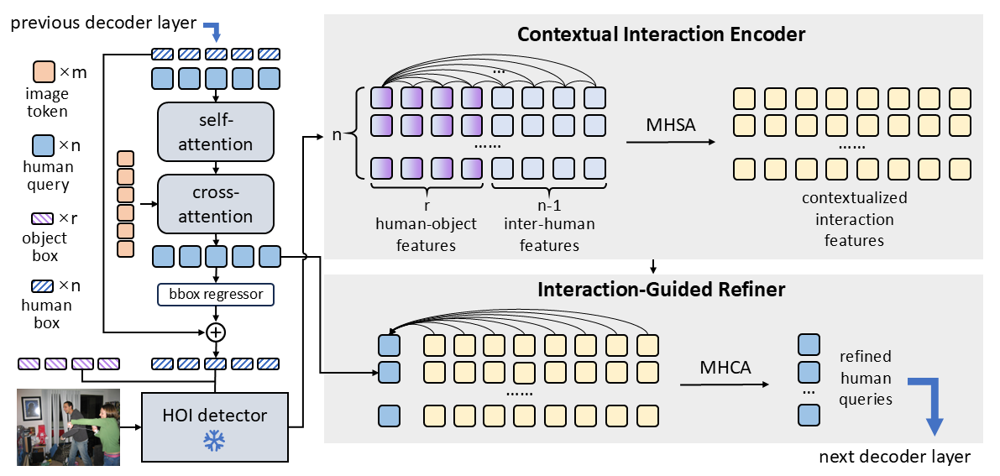

# InterMesh: Explicit Interaction-Aware End-to-End Multi-Person Human Mesh Recovery


## 🔍 Overview

**InterMesh** is a framework for 3D human mesh recovery from monocular RGB images that explicitly incorporates human-environment interaction cues, including both human-object and inter-human interactions, into the prediction process. Rather than relying solely on implicit modeling, InterMesh leverages structured semantic features extracted by an off-the-shelf HOI detector to guide mesh estimation. The framework is characterized by the following components:

- 💡 **Explicit Human-Environment Interaction Modeling**
- 🔄 **Contextual Interaction Encoder (CIE)**
- 🤝 **Interaction-Guided Refiner (IGR)**

<figure style="justify-content: center">
  
  <figcaption>Overview of InterMesh</figcaption>
</figure>

<figure style="justify-content: center">
  
  <figcaption>Illustration of InterMesh Decoder</figcaption>
</figure>

## 🔨 Installation

We recommend to use `Python=3.11`, `PyTorch=2.4.1` and `CUDA=12.1`.

```
conda create -n intermesh python=3.11
conda activate intermesh

conda install pytorch==2.4.1 torchvision==0.19.1 pytorch-cuda=12.1 -c pytorch -c nvidia
pip install -U xformers==0.0.28.post1 --index-url https://download.pytorch.org/whl/cu121
pip install -r requirements.txt
```

## 🧰 Datasets

Prepare datasets following [this instruction](https://github.com/ChiSu001/SAT-HMR/blob/main/docs/data_preparation.md).

## 📦 Checkpoints

- Download SMPL model from its [official website](https://smpl.is.tue.mpg.de/).
- Download SAT-HMR model from [huggingface](https://huggingface.co/ChiSu001/SAT-HMR). Skip this step if you only want to evaluate the model.
- Download checkpoints of InterMesh and EZ-HOI from [here](https://drive.google.com/drive/folders/1wEhWq5TEtajb-K9pPYtX_ppoL5YrHx-c?usp=drive_link).
- Structure the model weights as following.

```
|- PROJECT_ROOT_PATH
  |- weights
    |- ez_hoi
      |- detr-r50-hicodet.pth
      |- hico_HO_pt_uv_vitlarge.pt
      |- obj_embed_hico.pt
      |- ViT-L-14-336px.pt
    |- inter_mesh
      |- intermesh_3dpw.bin
      |- intermesh_hi4d.bin
      |- intermesh_mupots_panoptic.bin
      |- intermesh_stage1.bin
    |- sat_hmr (for training)
      |- sat_644.pth
    |- smpl_data
      |- smpl
          |- body_verts_smpl.npy
          |- J_regressor_h36m_correct.npy
          |- smpl_mean_params.npz
          |- SMPL_NEUTRAL.pkl
```

## 🚀 Training

Train on AGORA, BEDLAM, COCO, MPII, CrowdPose and Human3.6M datasets:
```
# Set up multi-gpu training via `accelerate config`. 
# We use two A800-80G GPUs to train the model.
accelerate config
accelerate launch main.py --mode train --cfg train_stage1
```

Finetune on 3DPW dataset:
```
accelerate launch main.py --mode train --cfg train_3dpw_ft
```

## 🎯 Evaluation

Evaluate on 3DPW dataset:

```
python main.py --mode eval --cfg eval_3dpw
```

Code for evaluation on other datasets will be released soon.

## 🪄 Inference

Inference on demo images in [demo](./demo/) and get result in [demo_results](./demo_results/):

```
python main.py --mode infer --cfg demo
```

## 🤝 Acknowledgements
This repository is built upon [SAT-HMR](https://github.com/ChiSu001/SAT-HMR) and [EZ-HOI](https://github.com/ChelsieLei/EZ-HOI). We thank the authors for open-sourcing their work.
